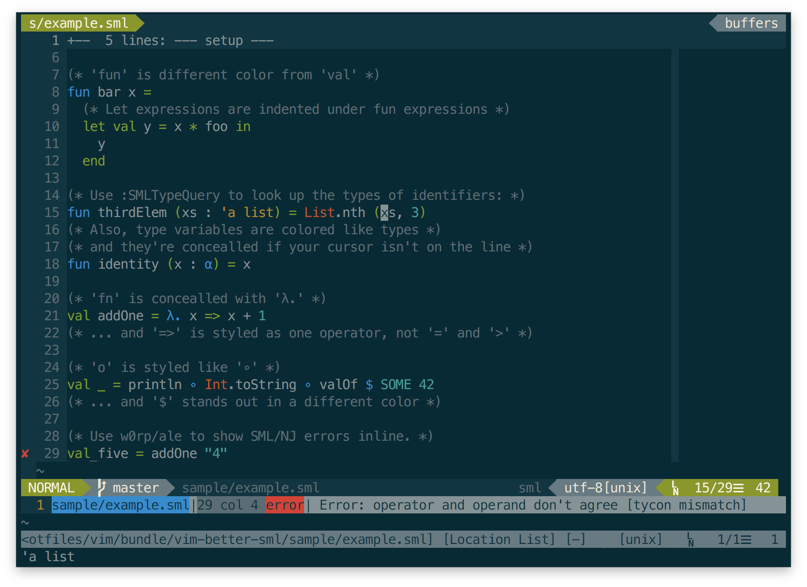

# vim-better-sml

> Some improvements to the default SML filetype plugins for Vim.

## Install

Install using your favorite plugin manager. For example, to install using
Vundle, add this line to your ~/.vimrc:

```
Plugin 'jez/vim-better-sml'
```

If you're unfamiliar using Vim plugins, check out [Vim as an IDE][vim-ide] which
will get you up to speed.

## Summary



## Features

### Type Information

- [x] Look up type of expression under cursor
  - **Requires some setup.** See below.
- [ ] Jump to definition
- [ ] Highlight all uses and definition
- [ ] Highlight unused definitions

### Syntax

- [x] Highlight `=>` correctly as a single operator
- [x] Highlight type variables
- [x] Set up conceal characters for common type variables (i.e., `'a -> α`, or
  `'a -> 'α` if you prefer; see "Configuration" below)
    - Note: concealing disabled by Vim by default. See "Configuration" below.
- [x] Highlight `fun` and `fn` with `Function` instead of `Keyword`
- [x] Set up conceal characters for `fn -> λ.`

### Other Syntax Definitions

- [x] Signature files (`*.sig`)
- [x] ML-Lex files (`*.lex`)
- [x] ML-Yacc files (`*.grm`)
- [x] Smackage files (`*.smackspec`)
- [x] CM files (`*.cm`)
- [x] MLBasis files (`*.mlbasis`)

### Indentation

- [x] `let` statements are indented under `fun` statements
- [x] Using handing `of` inside a parenthesized case statement is properly
  re-indented. For example, this:

      (case x
      of|)

  becomes

      (case x
         of|)

  This should already be handled when the expression is not parenthesized; we
  fix it when it is.
- [x] Smarter indentation when writing imperative code with `;`. For example:

        (print "hello\n";
        |)

  becomes

      (print "hello\n";
       |)

  That is, whenever a line ends in a `;`, the cursor is aligned to the first
  word character of the previous line, not to the first character on the line.
- [ ] Indent level is properly adjusted when using nested case statements.
  Consider the following snippet of SML:

      datatype ord = Z | S of ord | Sup of (int -> ord)

      fun toString n =
        case n
          of Z => "0"
           | S n' =>
               (case n'
                  of Z => "1"
                   | S _ => "1 < n < aleph"
                   | _ => "malformed")
           | Sup f => ">= aleph"

  Try transcribing this into Vim right now; the last line isn't indented
  properly. Right now, the indent file indents lines like the last line under
  the most recent `case` keyword, ignoring any nesting structure. See [this
  issue][issue-1] for some of my thoughts on the matter.

### Filetype

- [x] Treats apostrophes (`'`) as keyword characters (i.e., we can use "primes"
  in variable names)
- [x] Sets up the comment string properly. This is useful...
  - in conjunction with [tpope/vim-commentary], a plugin that sets up bindings
    for commenting/uncommenting regions in a file
  - when using `foldmethod=marker`, which inserts fold markers into the text
    wrapped in comments

### External Plugins

- __delimitMate__
  - [x] Sets up the appropriate quote characters
- __Syntastic__
  - [x] For the SML/NJ syntax checker, tries to check if you're using a CM file
    to build the project, and loads it appropriately.
- __a.vim__:
  - [x] Set up `*.sig` and `*.sml` as alternate extensions (similar to `*.h` and
    `*.cpp`)

## Using `:SMLTypeQuery`

There is a bit of setup involved before you can use `:SMLTypeQuery`.

1. Install `mlton`. MLton is an SML compiler (and a really nice one at that!).
  - <http://mlton.org/Installation>
  - On macOS: `brew install mlton`

1. Build `invert-def-use`. This is an SML script used by `vim-better-sml`.

        cd ~/.vim/bundle/vim-better-sml
        make

1. Configure your SML project to output `.du` files. See "Generating `.du`
   Files"

1. Place your cursor on an identifier, and call `:SMLTypeQuery`.

1. **Optional**: Add a mapping for `:SMLTypeQuery`

        augroup smlMaps
          au!
          au FileType sml nnoremap <leader>t :SMLTypeQuery<CR>
        augroup END

    Then just press `<leader>t`.

### Caveats

- **This only works with MLton.** If you are using another compiler, like SML/NJ,
  you will have to set up your project to build with MLton. In most cases, it's
  possible for them to co-exist.

  Refer to the documentation for MLBasis files (similar to CM files used by
  SML/NJ).

  - <http://mlton.org/MLBasisExamples>
  - <http://mlton.org/MLBasis>

- **You are responsible** for building the `.du` file. See "Generating `.du`
  Files" for how to do this.

- MLton takes a noticeable amount of time to compile even small projects. This
  is unavoidable.

### Generating `.du` Files

From [MLton](http://mlton.org/EmacsDefUseMode#_usage):

To use def-use mode one typically first sets up the program’s makefile or build
script so that the def-use information is saved each time the program is
compiled. In addition to the `-show-def-use file` option, the `-prefer-abs-paths
true` expert option is required. Note that the time it takes to save the
information is small (compared to type-checking), so it is recommended to simply
add the options to the MLton invocation that compiles the program. However, it
is only necessary to type check the program (or library), so one can specify the
`-stop tc` option. For example, suppose you have a program defined by an MLB
file named `my-prg.mlb`, you can save the def-use information to the file
`my-prg.du` by invoking MLton as:

```
mlton -prefer-abs-paths true -show-def-use my-prg.du -stop tc my-prg.mlb
```

It's important that the filename be given a `.du` extension.

## Configuration

The behavior of `vim-better-sml` can be configured.

### `conceallevel`

By default, Vim conceal characters are turned off (except for some filetypes,
like Vim help files). To turn conceal characters on for `sml`, use:

```
au FileType sml setlocal conceallevel=2
```

See `:help conceallevel` for the full range of options you can set.

### `g:sml_greek_tyvar_show_tick`

By default, we conceal `'a` to `α`. You can instead make `'a` become `'α` using:

```
let g:sml_greek_tyvar_show_tick = 1
```

## License

[](https://jez.io/MIT-LICENSE.txt)


<!-- References -->

[vim-ide]: https://github.com/jez/vim-as-an-ide
[issue-1]: https://github.com/jez/vim-better-sml/issues/1
[tpope/vim-commentary]: https://github.com/tpope/vim-commentary
